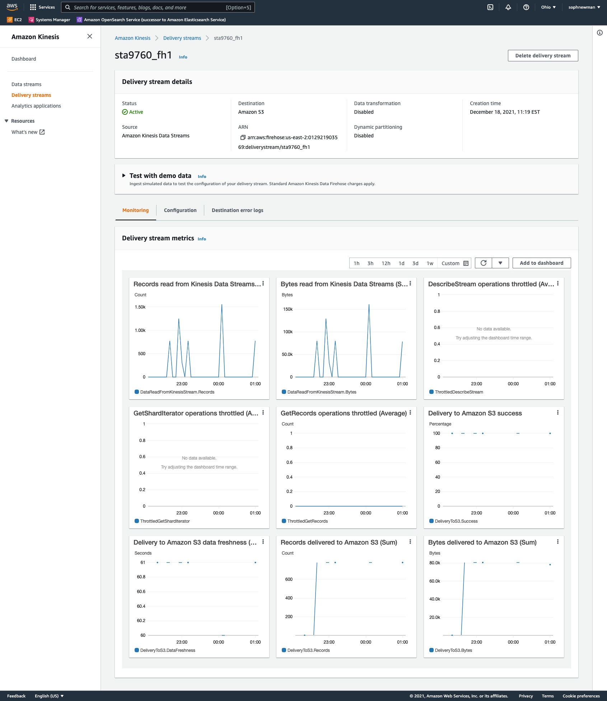
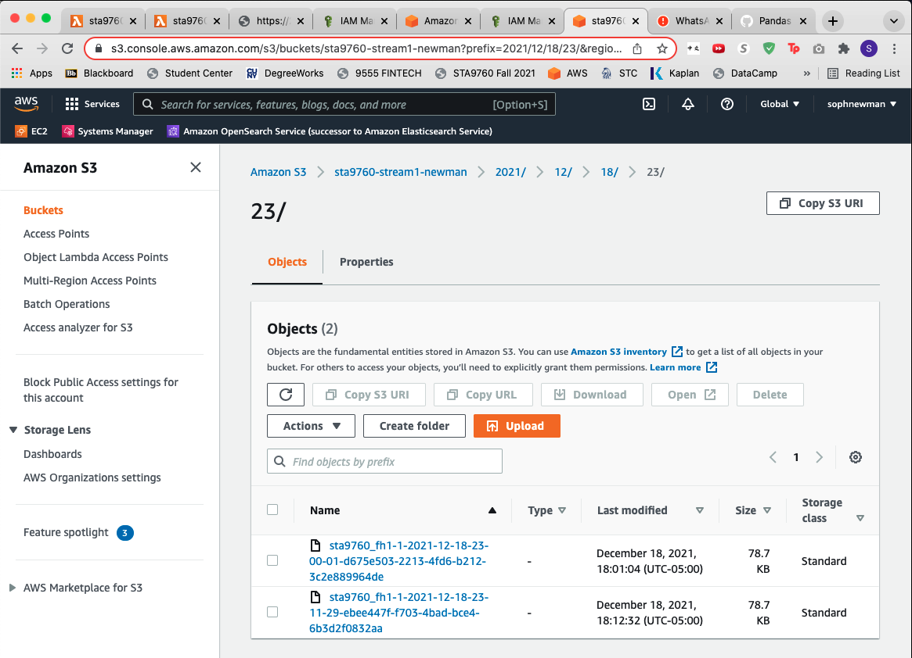

## Sophia Newman - 12/18/2021 

## STA9760 - Project 3
#### Professor Mottaqui Karim, Fall 2021

## Streaming Finance Data with AWS Lambda
### Project Overview
Project 3 challenges us to utilize a multiple AWS technologies to gather and analyze the stock pricing data of 10 tickers: FB, SHOP, BYND, NFLX. PINS, SQ, TTD, OKTA, SNAP, DDOG. Using Yahoo Finance stock pricing data, we collected one full trading day's worth of the stocks' high and low prices. For this project, we focused on gathering the stock pricing data for Tuesday, November 30th, 2021 at a five minute interval. The technologies that were emphasized in this project include AWS Kinesis, AWS S3, AWS Glue, AWS Lambda, AWS Athena, as well as the scripting language Python. 

## AWS Kinesis Data Stream

## AWS S3 Bucket

